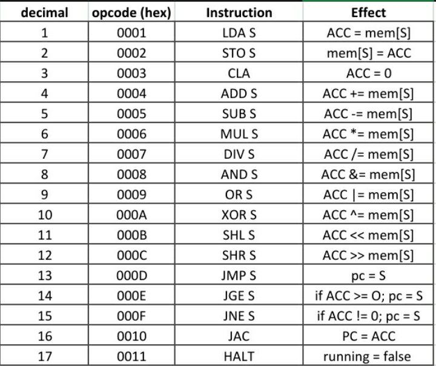

# § memory

``` c
int32_t mem[INT16_MAX];
``` 

|  memory structure  | range (in hex) |
|--------------------|----------------|
| data memory        | 0000  - 1110   |
| instruction memory | 1110  - ffff   |

this virtual machine uses a **32 bit memory** with **16 bit addresses**

example:
``` c
mem[0x0000] = 00030001;
mem[0x0001] = 00010000;
``` 
addresses can range from 0000 to ffff while the contents of each address can range from 00000000 to ffffffff

### why are addresses organized like this?
because instructions have **16 bits for opcode** and **16 bits for operand**, thus, an instruction like *jmp 1112* can only take 16 bits as parameter, and can be represented in memory as:

``` c
mem[0x0000] = 000d1112;   // jmp 0x1112
``` 
with *000d* being the value for the opcode JMP and *1112* as being the location in memory to where to jump

# § instructions 
the following table represents the value, mnemonic and effect of each instruction

